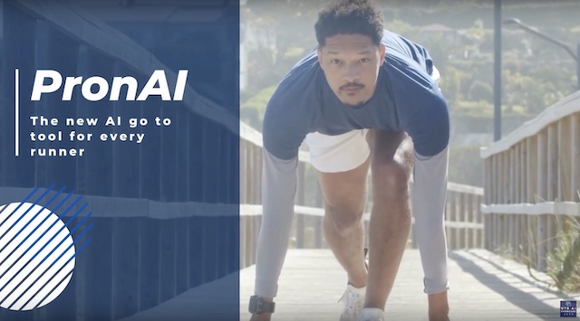

# BootCamp: Computer Vision and Deep Learning @   Siliguri Institute of Technology, Siliguri

**Start date:** 22nd September 2023 

**Dr. Nabin Sharma, PhD, SMIEEE**  
Associate Professor, 
Co-Director (Intelligent Drone Lab), 
Faculty of Engineering and Information Technology, 
University of Technology Sydney, 
School of Computer Science, 
Broadway, Ultimo, NSW 2007 Australia 
**Email**: Nabin.Sharma@uts.edu.au

## Topics:
* Introduction to AI, Machine Learning, Deep Learning and Computer Vision fundamentals.
* Understand the difference between traditional machine learning and Deep Learning.
* Able to Build, Train, and Test a Convolutional Neural Network (CNN) from scratch.
* Learn to use libraries and framework for implementing Deep CNN architectures.
* Able to create custom architectures for Image Classification using CNNs
* Object Detection, Semantic Segmentation and Instance Segmentation using CNNs
* Collaboratively Analyze, design, implement and test solutions to real-world computer vision related problems.

## Schedule
* **Day-1:**
  1. Introduction to AI, ML, DL and CV
  2. History of Deep Learning
  3. Hands-on: Using Google Colab and Python, OpenCV library for basic tasks such as: Read/Write/Manipulate images, thresholding, edge detection etc.  

* **Day-2:**
  1. Image Processing Basics, edge detection
  2. Hands-on: Edge detection using Convolution operation
 
* **Day-3:**
  1. Handcrafted Feature extraction: HoG (Gradient based), LBP (Texture)
  2. Neural Network basics
  3. Logistic regression/ Binary classification using a Neural Network
  4. Understanding: Loss Function, Activation function, Basics of Optimization
  5. Strategies for training a Neural Network
  6. Hands-on: Using handcrafted features, Logistic Regression using Neural Network

## References:
* OpenCV Tutorial and reference: <a>https://github.com/dalgu90/opencv-tutorial</a>
* Python and Numpy: <a>https://cs231n.github.io/python-numpy-tutorial/ </a>
* Numpy: <a>https://numpy.org/learn/ </a>
* Pythorch : <a> https://pytorch.org/tutorials/ </a>
* Deep Learning: 
  1.(<a>http://www.deeplearningbook.org/ </a>) (<a>https://github.com/janishar/mit-deep-learning-book-pdf</a>) 
  2. <a>https://d2l.ai/index.html</a>
* Object Detection: TBA

## Computing resources:
* AWS Studio Labs: <a> https://studiolab.sagemaker.aws/ </a> (Apply for a freee account without any credit card)
* Google Colab

## Example Computer Vision and Deep Learning Projects https:

